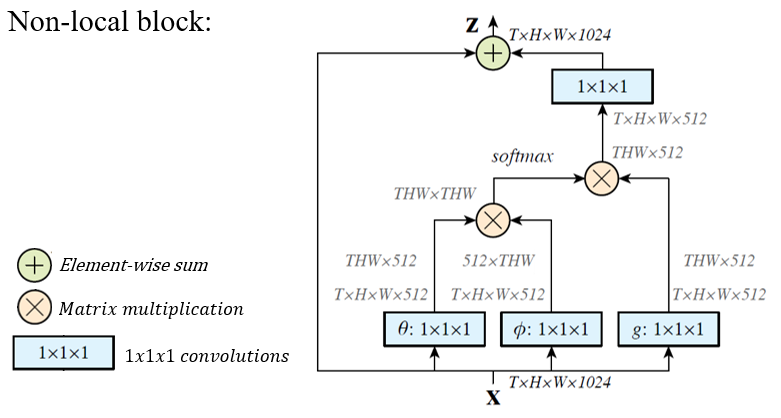
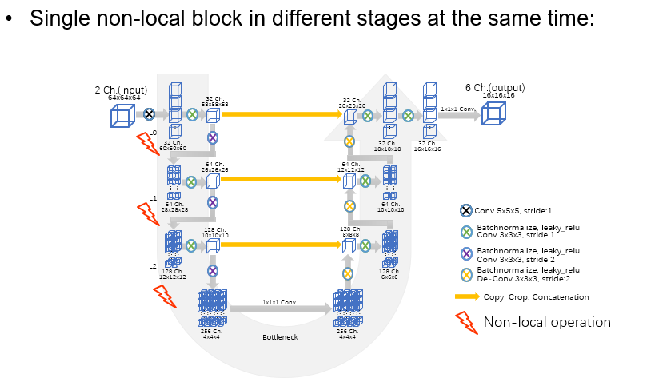
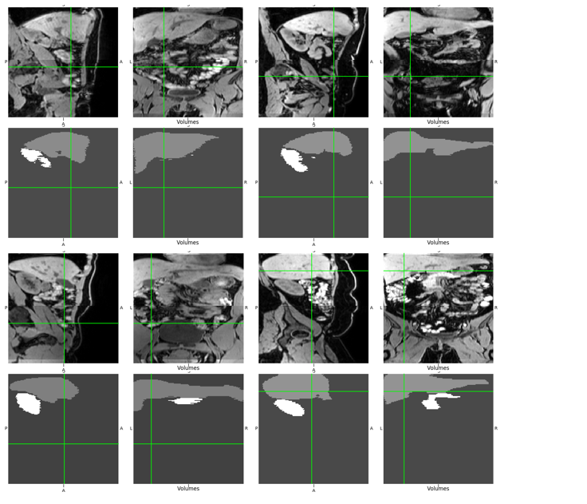

## Overview
This framework is provided to perform pixel-level segmentation of human liver, spleen, pancreas and kidney, based on MR images provided by German National Cohort(NAKO Dataset), using deep-learning method, and visualized the results. It establishes all functionality needed to operate on 3D images with a patch-based architecture.  

NAKO Dataset：  
- Over 3400 labeled MRI images from thousands patients
- Over 500 MRI images for evaluation  

  

Used network architectures including 3d u-net, non-local neural network, attention u-net are proposed.  

Arxiv:  

## Installation

use pip3 (with a venv)

    pip3 install -e .

if it fails consider

    pip3 install -e . --user
    
## Usage

For training use

    nohup python3 -u train.py > file_out 2> file_err &
    
For prediction use

    nohup python3 -u evaluate.py > file_out 2> file_err &

## Algorithm
### non-local neural network
Inspired by the popular NLP Transformer architecture proposed by Google in 2017, an architecture of similar idea is proposed for image processing, the non-local neural networks.  

It can capture the long-range dependencies between pixels more properly, check the paper from Wang Xiaolong https://arxiv.org/abs/1711.07971  

Its architecture as following:  

### 3d U-net as baseline
Baseline architecture is a 4-stages 3d u-net, as following:  

  

## Results
Achieve an average accurancy of 97% of all classes.  

  

 
